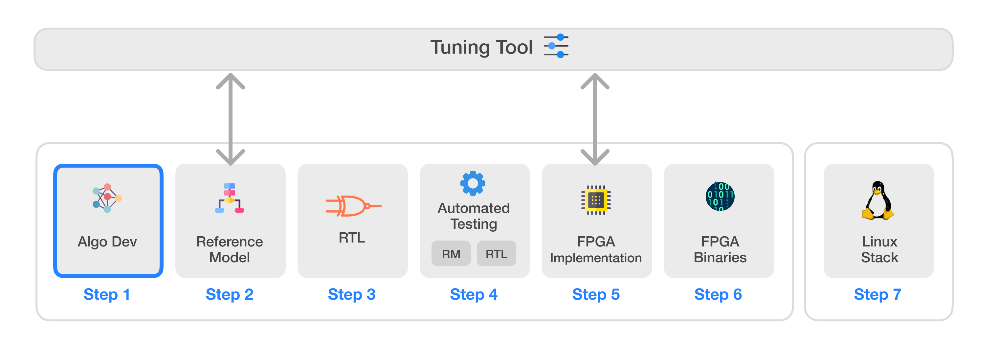
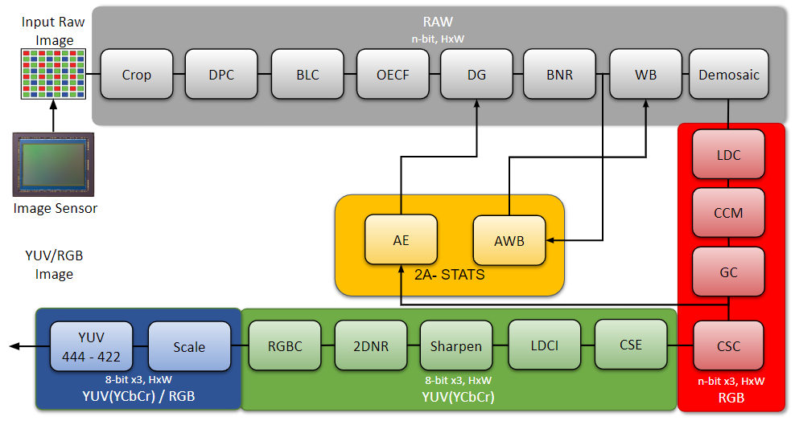

# Infinite-ISP
Infinite-ISP는 하드웨어 ISP의 모든 측면을 위해 설계된 풀스택 ISP 개발 플랫폼입니다. Python으로 작성된 카메라 파이프라인 모듈 모음, 고정소수점 참조 모델, 최적화된 RTL 설계, FPGA 통합 프레임워크 및 Xilinx® Kria KV260 개발 보드용 관련 펌웨어를 포함합니다. 이 플랫폼은 다양한 센서와 애플리케이션에 대한 ISP 파라미터 튜닝을 가능하게 하는 독립형 Python 기반 튜닝 도구를 제공합니다. 마지막으로, 필요한 드라이버와 커스텀 애플리케이션 개발 스택을 제공하여 Infinite-ISP를 Linux 플랫폼에서 사용할 수 있는 소프트웨어 솔루션도 제공합니다.

## 웹 데모
브라우저에서 Infinite-ISP를 체험해보세요:
[](https://infinite-isp.10xengineers.ai/)

웹 데모가 준비되어 있습니다. 위 버튼을 클릭하여 지금 바로 체험해보세요.
피드백 / 이슈: GitHub Issue를 열어주세요 (라벨: `demo`).




| 번호    | 레포지토리 이름        | 설명      |
|---------| -------------  | ------------- |
| 1  | **[Infinite-ISP_AlgorithmDesign](https://github.com/10x-Engineers/Infinite-ISP)** :anchor:  | 알고리즘 개발을 위한 Python 기반 Infinite-ISP 파이프라인 모델 |
| 2  | **[Infinite-ISP_ReferenceModel](https://github.com/10x-Engineers/Infinite-ISP_ReferenceModel)**                      | 하드웨어 구현을 위한 Python 기반 고정소수점 Infinite-ISP 파이프라인 모델 |
| 3  | **[Infinite-ISP_RTL](https://github.com/10x-Engineers/Infinite-ISP_RTL)**  | 참조 모델 기반의 이미지 신호 처리기 RTL Verilog 설계 |
| 4  | **[Infinite-ISP_AutomatedTesting](https://github.com/10x-Engineers/Infinite-ISP_AutomatedTesting)** | 비트 정확한 설계를 보장하기 위한 이미지 신호 처리기의 자동화된 블록 및 다중 블록 레벨 테스팅 프레임워크 |
| 5  | **FPGA 구현**  | Infinite-ISP의 FPGA 구현 <br>  <ul><li>Xilinx® Kria KV260의 XCK26 Zynq UltraScale + MPSoC **[Infinite-ISP_FPGA_XCK26](https://github.com/10x-Engineers/Infinite-ISP_FPGA_XCK26)** </li></ul>   |
| 6  | **[Infinite-ISP_FPGABinaries](https://github.com/10x-Engineers/Infinite-ISP_FPGABinaries)**         | Xilinx® Kria KV260의 XCK26 Zynq UltraScale + MPSoC용 FPGA 바이너리 (비트스트림 + 펌웨어 실행 파일)|
| 7  | **[Infinite-ISP_TuningTool](https://github.com/10x-Engineers/Infinite-ISP_TuningTool)**                              | Infinite-ISP를 위한 캘리브레이션 및 분석 도구 모음 |
| 8  | **[Infinite-ISP_LinuxCameraStack](https://github.com/10x-Engineers/Infinite-ISP_LinuxCameraStack.git)** | Infinite-ISP에 대한 Linux 지원 확장 및 Linux 기반 카메라 애플리케이션 스택 개발 |


<a href="https://docs.google.com/forms/d/e/1FAIpQLSfOIldU_Gx5h1yQEHjGbazcUu0tUbZBe0h9IrGcGljC5b4I-g/viewform?usp=sharing" target="_blank">
    
</a>

위 버튼을 클릭하여 <b>Infinite_ISP-RTL</b>, <b>Infinite-ISP_AutomatedTesting</b>, <b>Infinite-ISP_FPGA_XCK26</b> 레포지토리에 대한 접근 권한을 요청하세요

# Infinite-ISP 알고리즘 설계: ISP 알고리즘 개발을 위한 Python 기반 모델
Infinite-ISP 알고리즘 설계는 센서로부터 입력된 RAW 이미지를 출력 RGB 이미지로 변환하기 위해 애플리케이션 레벨에서 구현된 카메라 파이프라인 모듈의 모음입니다. Infinite-ISP는 각 모듈 레벨에서 간단한 것부터 복잡한 알고리즘까지 포함하는 것을 목표로 합니다.




`Infinite-ISP v1.1`을 위한 ISP 파이프라인

## 목표
인터넷에는 많은 오픈소스 ISP가 있습니다. 대부분은 개별 기여자들에 의해 개발되었으며, 각각 고유한 강점을 가지고 있습니다. 이 프로젝트는 모든 오픈소스 ISP 개발을 한 곳에 집중시켜 모든 ISP 개발자들이 기여할 수 있는 단일 플랫폼을 제공하는 것을 목표로 합니다. InfiniteISP는 기존의 알고리즘뿐만 아니라 최신 딥러닝 알고리즘도 포함하여 두 가지를 깔끔하게 비교할 수 있도록 할 것입니다. 이 프로젝트는 아이디어에 제한이 없으며, 복잡성에 관계없이 파이프라인의 전체 결과를 향상시키는 모든 알고리즘을 포함하는 것을 목표로 합니다.


## 기능 비교 매트릭스

유명한 openISP와의 기능 비교입니다.

InfiniteISP는 **3A 알고리즘**도 시뮬레이션합니다.

| 모듈        | infiniteISP  | openISP        |
| -------------  | ------------- |  ------------- |
| 크롭                                          | 베이어 패턴 안전 크롭    | ---- |
| 불량 픽셀 보정                         | 수정된 [Yongji et al, Dynamic Defective Pixel Correction for Image Sensor](https://ieeexplore.ieee.org/document/9194921) | 예 |
| 블랙 레벨 보정                        | 캘리브레이션 / 센서 의존 <br> - 설정에서 BLC 적용   | 예 |
| 광전자 전달 함수 (OECF)   | 캘리브레이션 / 센서 의존 <br> - 설정에서 LUT 구현 | ---- |
| 안티앨리어싱 필터                          | ----  | 예 |
| 디지털 게인                                  | 설정 파일에서 게인 적용 | 밝기 대비 제어 |
| 렌즈 쉐이딩 보정                       | 구현 예정  | ---- |
| 베이어 노이즈 감소                         | [Tan et al의 Green Channel Guiding Denoising](https://www.researchgate.net/publication/261753644_Green_Channel_Guiding_Denoising_on_Bayer_Image)  | 크로마 노이즈 필터링 |
| 화이트 밸런스                                 | 설정 파일에서 WB 게인 적용  | 예 |
| CFA 보간                             | [Malvar He Cutler](https://www.ipol.im/pub/art/2011/g_mhcd/article.pdf) 디모자이킹 알고리즘  | 예 <br> - Malvar He Cutler|
| **3A 알고리즘**                           | **AE & AWB** | ---- |
| 자동 화이트 밸런스                            | - [Grey World](https://www.sciencedirect.com/science/article/abs/pii/0016003280900587) <br> - [Norm 2](https://library.imaging.org/admin/apis/public/api/ist/website/downloadArticle/cic/12/1/art00008) <br> - [PCA 알고리즘](https://opg.optica.org/josaa/viewmedia.cfm?uri=josaa-31-5-1049&seq=0) | ---- |
| 자동 노출                                 | - 왜도 기반 [자동 노출](https://www.atlantis-press.com/article/25875811.pdf) | ---- |
| 색상 보정 매트릭스                       | 캘리브레이션 / 센서 의존 <br> - 설정에서 3x3 CCM 적용  | 예 <br> - 4x3 CCM  |
| 감마 톤 매핑                            | 설정 파일에서 RGB 감마 LUT 적용  | 예 <br> - YUV 및 RGB 도메인|
| 색공간 변환                        | YCbCr 디지털 <br> - BT 601 <br> - BT 709  <br>   | 예 <br> - YUV 아날로그 |
| 색상 채도 향상                   | YUV/YCrCb 도메인의 크로마 채널에 채도 게인 적용| 예|
| 대비 향상                          | 수정된 [대비 제한 적응형 히스토그램 균등화](https://arxiv.org/ftp/arxiv/papers/2108/2108.12818.pdf#:~:text=The%20technique%20to%20equalize%20the,a%20linear%20trend%20(CDF))  | ---- |
| 에지 향상 / 샤프닝                | 강도 조절이 가능한 간단한 언샤프 마스킹 | 예 |
| 노이즈 감소                               | [비지역 평균 필터](https://www.ipol.im/pub/art/2011/bcm_nlm/article.pdf) | 예 <br> - NLM 필터 <br> - 양방향 노이즈 필터|
| 색조 채도 제어                        | ---- | 예 |
| RGB 변환 | YUV에서 RGB로 역변환 적용 - CSC와 동일한 표준| 아니오|
| 스케일                                         | - 정수 스케일링  <br> - 비정수 스케일링 | ---- |
| 가짜 색상 억제                       | ---- | 예 |
| YUV 포맷                                    | - YUV - 444 <br> - YUV - 422 <br>  | ---- |


## 의존성
이 프로젝트는 `Python_3.9.12`와 호환됩니다.

의존성은 [requirements.txt](requirements.txt) 파일에 나열되어 있습니다.

이 프로젝트는 pip 패키지 매니저가 사전 설치되어 있다고 가정합니다.

## 실행 방법
파이프라인을 실행하려면 다음 단계를 따르세요:
1. 다음 명령으로 레포지토리를 클론합니다:
```shell
git clone https://github.com/10xEngineersTech/Infinite-ISP_ReferenceModel
```

2. requirements 파일에서 모든 의존성을 설치합니다:
```shell
# Conda 환경을 사용하는 경우, 먼저 환경 내에 pip를 설치하는 것을 권장합니다.
# conda install pip
pip install -r requirements.txt
```
3. [isp_pipeline.py](isp_pipeline.py)를 실행합니다:
```shell
python isp_pipeline.py
```

### 예제

[in_frames/normal](in_frames/normal) 폴더에 튜닝된 설정과 함께 몇 개의 샘플 이미지가 이미 프로젝트에 추가되어 있습니다. 이 중 하나를 실행하려면 설정 파일 이름을 제공된 샘플 설정 중 하나로 교체하면 됩니다. 예를 들어 `Indoor1_2592x1536_12bit_RGGB.raw`에서 파이프라인을 실행하려면 [isp_pipeline.py](isp_pipeline.py)에서 설정 파일 이름과 데이터 경로를 다음과 같이 교체하세요:

```python
CONFIG_PATH = './config/Indoor1_2592x1536_12bit_RGGB-configs.yml'
RAW_DATA = './in_frames/normal/data'
```

## 여러 이미지/데이터셋에서 파이프라인 실행 방법

[isp_pipeline_multiple_images.py](isp_pipeline_multiple_images.py)라는 또 다른 스크립트가 있으며, 두 가지 모드로 Infinite-ISP를 여러 이미지에서 실행합니다:


1. 데이터셋 처리
    <br>여러 이미지를 실행합니다. RAW 이미지는 `<filename>-configs.yml` 이름의 자체 설정 파일이 있어야 합니다. 여기서 `<filename>`은 RAW 파일명이며, 그렇지 않으면 기본 설정 파일 [configs.yml](config/configs.yml)이 사용됩니다.

    NEF, DNG, CR2와 같은 RAW 이미지 포맷의 경우, 이러한 RAW 파일 메타데이터에 제공된 센서 정보를 추출하고 기본 설정 파일을 업데이트하는 기능도 제공합니다.

2. 비디오 모드
   <br>데이터셋의 각 이미지는 순서대로 비디오 프레임으로 간주됩니다. 모든 이미지는 [configs.yml](config/configs.yml)의 동일한 설정 파라미터를 사용하며, 한 프레임에서 계산된 3A 통계는 다음 프레임에 적용됩니다.

레포지토리를 클론하고 모든 의존성을 설치한 후 다음 단계를 따르세요:

1. `DATASET_PATH`를 데이터셋 폴더로 설정합니다. 예를 들어 이미지가 [in_frames/normal/data](in_frames/normal/data) 폴더에 있는 경우:
```python
DATASET_PATH = './in_frames/normal/data'
```

2. 데이터셋이 다른 git 레포지토리에 있는 경우 루트 디렉토리에서 다음 명령을 사용하여 서브모듈로 추가할 수 있습니다. 명령에서 `<url>`은 `https://github.com/<user>/<repository_name>`과 같은 git 레포지토리 주소이고, `<path>`는 서브모듈을 추가할 레포지토리 내 위치입니다. Infinite ISP의 경우 `<path>`는 `./in_frames/normal/<dataset_name>`이어야 합니다. `<dataset_name>`은 `data`가 아니어야 합니다. [in_frames/normal/data](in_frames/normal/data) 디렉토리가 이미 존재하기 때문입니다.

```shell
git submodule add <url> <path>
git submodule update --init --recursive
```


4. git 레포지토리를 서브모듈로 추가한 후 [isp_pipeline_dataset.py](isp_pipeline_dataset.py)의 `DATASET_PATH` 변수를 `./in_frames/normal/<dataset_name>`으로 업데이트합니다. Git은 서브모듈을 사용하여 레포지토리의 하위 폴더를 가져오는 것을 허용하지 않습니다. 전체 레포지토리만 추가한 다음 폴더에 접근할 수 있습니다. 서브모듈의 하위 폴더에서 이미지를 사용하려면 [isp_pipeline_dataset.py](isp_pipeline_dataset.py) 또는 [video_processing.py](video_processing.py)의 `DATASET_PATH` 변수를 적절히 수정하세요.

```python
DATASET_PATH = './in_frames/normal/<dataset_name>'
```

5. `isp_pipeline_dataset.py` 또는 `video_processing.py`를 실행합니다.
6. 처리된 이미지는 [out_frames](out_frames/) 폴더에 저장됩니다.

## 테스트 벡터 생성
개별 또는 다중 모듈을 테스트 대상 장치(DUT)로 하여 여러 이미지에 대한 테스트 벡터를 생성하는 방법은 제공된 [지침](test_vector_generation/README.md)을 참조하세요.

## 기여하기

Pull Request를 하기 전에 [기여 가이드라인](docs/CONTRIBUTIONS.md)을 읽어주세요.

## 결과
다음은 시중의 경쟁 ISP와 비교한 이 파이프라인의 결과입니다.
우리 ISP의 출력은 오른쪽에, 기준이 되는 ground truth는 왼쪽에 표시됩니다.


&emsp;&emsp;&emsp;&emsp;&emsp;&emsp;&emsp;&emsp;&emsp;&emsp; **ground truth**     &emsp;&emsp;&emsp;&emsp;&emsp;&emsp;&emsp;&emsp;&emsp;&emsp;&emsp;&emsp;&emsp;&emsp;&emsp;&emsp;&emsp;&emsp;&emsp;&emsp;&emsp;&emsp;&emsp;&emsp;&emsp;&emsp; **infiniteISP**


PSNR 및 SSIM 이미지 품질 메트릭 기반의 위 결과 비교

| 이미지    | PSNR  | SSIM  |
|-----------|-------|-------|
| Indoor1   |20.0974     |0.8599
|Outdoor1   |21.8669     |0.9277
|Outdoor2   |20.3430     |0.8384
|Outdoor3   |19.3627     |0.8027
|Outdoor4   |20.7741     |0.8561

## 사용자 가이드

[isp_pipeline.py](isp_pipeline.py)를 실행하여 프로젝트를 실행할 수 있습니다. 이것은 [configs.yml](config/configs.yml)에서 모든 알고리즘 파라미터를 로드하는 메인 파일입니다.
설정 파일에는 파이프라인에 구현된 각 모듈에 대한 태그가 포함되어 있습니다. 각 모듈에 대한 간략한 설명과 사용법은 다음과 같습니다:

### 플랫폼

| platform            | 설명 |
| -----------         | --- |
| filename            | 파이프라인 실행을 위한 파일 이름을 지정합니다. 파일은 [in_frames/normal](in_frames/normal) 디렉토리에 위치해야 합니다
| disable_progress_bar| 시간이 소요되는 모듈에 대한 진행률 표시줄을 활성화하거나 비활성화합니다
| leave_pbar_string   | 완료 시 진행률 표시줄을 숨기거나 표시합니다

### 센서 정보

| sensor Info   | 설명 |
| -----------   | --- |
| bayer_pattern | RAW 이미지의 베이어 패턴을 소문자로 지정합니다 <br> - `bggr` <br> - `rgbg` <br> - `rggb` <br> - `grbg`|
| range         | 사용되지 않음 |
| bit_depth        | RAW 이미지의 비트 깊이 |
| width         | 입력 RAW 이미지의 너비 |
| height        | 입력 RAW 이미지의 높이 |
| hdr           | 사용되지 않음 |

### 크롭

| crop          | 설명 |
| -----------   | --- |
| is_enable      | 이 모듈을 활성화하거나 비활성화합니다. 활성화되면 베이어 패턴이 유지되는 경우에만 크롭합니다
| is_debug       | 모듈 디버그 로그를 출력하는 플래그
| new_width     | 크롭 후 입력 RAW 이미지의 새 너비
| new_height    | 크롭 후 입력 RAW 이미지의 새 높이

### 불량 픽셀 보정

| dead_pixel_correction | 설명 |
| -----------           |   ---   |
| is_enable              | 이 모듈을 활성화하거나 비활성화합니다
| is_debug               | 모듈 디버그 로그를 출력하는 플래그
| dp_threshold          | DPC 모듈을 튜닝하기 위한 임계값. 임계값이 낮을수록 더 많은 픽셀이 불량으로 감지되어 보정됩니다

### HDR 스티칭

구현 예정

### 블랙 레벨 보정

| black_level_correction  | 설명 |
| -----------             |   ---   |
| is_enable                | 이 모듈을 활성화하거나 비활성화합니다
| r_offset                | 레드 채널 오프셋
| gr_offset               | Gr 채널 오프셋
| gb_offset               | Gb 채널 오프셋
| b_offset                | 블루 채널 오프셋
| is_linear                | 선형화를 활성화하거나 비활성화합니다. 활성화되면 BLC 오프셋은 0에 매핑되고 포화는 사용자가 지정한 최대 비트 범위에 매핑됩니다
| r_sat                   | 레드 채널 포화 레벨
| gr_sat                  | Gr 채널 포화 레벨
| gb_sat                  | Gb 채널 포화 레벨
| b_sat                   | 블루 채널 포화 레벨

### 광전자 변환 함수

| OECF  | 설명 |
| -----------     |   ---   |
| is_enable        | 이 모듈을 활성화하거나 비활성화합니다
| r_lut           | OECF 곡선을 위한 룩업 테이블. 이 곡선은 대부분 센서에 따라 다르며 표준 기법을 사용한 캘리브레이션으로 구합니다

### 디지털 게인

| digital_gain    | 설명 |
| -----------     |   ---   |
| is_enable        | 이것은 필수 모듈이며 비활성화할 수 없습니다
| is_debug         | 모듈 디버그 로그를 출력하는 플래그
| gain_array      | 게인 배열. 사용자는 여기에 나열된 게인 중 하나를 선택할 수 있습니다. 이 모듈은 AE 모듈과 함께 작동합니다 |
| current_gain    | 0부터 시작하는 현재 게인 인덱스 |

### 렌즈 쉐이딩 캘리브레이션

구현 예정

### 베이어 노이즈 감소

| bayer_noise_reduction   | 설명 |
| -----------             |   ---   |
| is_enable                | 활성화되면 사용자가 지정한 파라미터를 사용하여 베이어 도메인에서 노이즈를 감소시킵니다 |
| filt_window             | 홀수 윈도우 크기여야 합니다
| r_std_dev_s               | 레드 채널 가우시안 커널 강도. 강도가 높을수록 블러링이 강해집니다. 0이 될 수 없습니다
| r_std_dev_r               | 레드 채널 범위 커널 강도. 강도가 높을수록 에지가 더 잘 보존됩니다. 0이 될 수 없습니다
| g_std_dev_s               | Gr 및 Gb 가우시안 커널 강도
| g_std_dev_r               | Gr 및 Gb 범위 커널 강도
| b_std_dev_s               | 블루 채널 가우시안 커널 강도
| b_std_dev_r               | 블루 채널 범위 커널 강도


### 화이트 밸런스

| white_balance           | 설명 |
| -----------             |   ---   |
| is_enable                | 활성화되면 사용자가 지정한 화이트 밸런스 게인을 적용합니다 |
| is_auto                  | true이면 3A - AWB를 활성화하고 사용자가 지정한 WB 게인을 사용하지 않습니다 |
| r_gain                  | 레드 채널 게인 |
| b_gain                  | 블루 채널 게인 |

### 3A - 자동 화이트 밸런스 (AWB)
| auto_white_balance      | 설명 |
| -----------             |   ---   |
| is_debug         | 모듈 디버그 로그를 출력하는 플래그|
| underexposed_percentage   | AWB 게인 계산 전에 제외할 어두운 픽셀의 %를 설정합니다|
| overexposed_percentage    | AWB 게인 계산 전에 제외할 포화 픽셀의 %를 설정합니다|
| algorithm               | 다음 알고리즘 중 하나를 선택할 수 있습니다 <br> - `grey_world`  <br> - `norm_2`  <br> - `pca` |
| percentage              | [0 - 100] - PCA 알고리즘에서 어두운-밝은 픽셀 비율을 선택하는 파라미터 |

### 색상 보정 매트릭스 (CCM)

| color_correction_matrix                 | 설명 |
| -----------                             |   ---   |
| is_enable                                | 활성화되면 사용자가 지정한 3x3 CCM을 3D RGB 이미지에 적용합니다 (행 합이 1인 규칙) |
| corrected_red                           | CCM의 1행
| corrected_green                         | CCM의 2행
| corrected_blue                          | CCM의 3행

### 감마 보정
| gamma_correction        | 설명 |
| -----------             |   ---   |
| is_enable                | 활성화되면 LUT를 사용하여 톤 매핑 감마를 적용합니다 |
| gamma_lut_8                | 8비트 감마 곡선을 위한 룩업 테이블 |
| gamma_lut_10                | 10비트 감마 곡선을 위한 룩업 테이블 |
| gamma_lut_12               | 12비트 감마 곡선을 위한 룩업 테이블 |
| gamma_lut_14              | 14비트 감마 곡선을 위한 룩업 테이블 |

### 3A - 자동 노출
| auto_exposure      | 설명
|--------------------|----------------------------------------------------------------------------------------------|
| is_enable           | 활성화되면 3A-자동 노출 알고리즘을 적용합니다                                         |
| is_debug            | 모듈 디버그 로그를 출력하는 플래그                                                             |
| center_illuminance | 왜도 계산을 위한 중심 조도 값, 0에서 255 사이. 기본값은 90 |
| histogram_skewness | 히스토그램 왜도 범위는 정확한 노출 계산을 위해 0에서 1 사이여야 합니다   |

### 색공간 변환 (CSC)

| color_space_conversion | 설명                                                                             |
|------------------------|-------------------------------------------------------------------------------------|
| is_enable               | 이것은 필수 모듈이며 비활성화할 수 없습니다                                   |
| conv_standard          | 변환에 사용할 표준 <br> - `1` : Bt.709 HD <br> - `2` : Bt.601/407 |

### 색상 채도 향상 (CSE)

| color_saturation_enhancement | 설명                                                                             |
|------------------------|-------------------------------------------------------------------------------------|
| is_enable               | 활성화되면 색상 채도 향상이 크로마 채널에 적용됩니다|                                  |
| saturation_gain         | 색상 채도를 얼마나 증가시킬지 제어하는 양의 실수 게인으로, 두 크로마 채널 모두에 적용됩니다 |

### 대비 향상

| ldci       | 설명                                                                      |
|------------|----------------------------------------------------------------------------- |
| is_enable   | 활성화되면 Y 채널에 지역 동적 대비 향상이 적용됩니다  |
| clip_limit | 향상할 디테일의 양을 제어하는 클리핑 제한             |
| wind       | 필터를 적용할 윈도우 크기                                              |

### 에지 향상 / 샤프닝

| Sharpening         | 설명                                           |
|--------------------|---------------------------------------------------|
| is_enable           | 활성화되면 샤프닝을 적용합니다 |
| sharpen_sigma      | 가우시안 필터의 표준 편차를 정의합니다 |
| sharpen_strength   | 고주파 성분에 적용되는 샤프닝 강도를 제어합니다  |


### 2D 노이즈 감소

| 2d_noise_reduction | 설명                                           |
|--------------------|---------------------------------------------------|
| is_enable           | 활성화되면 2D 노이즈 감소를 적용합니다 |
| algorithm          | 다음 알고리즘 중 하나를 선택할 수 있습니다  <br> - `nlm`  <br> - `ebf` |
| window_size        | 비지역 평균 적용을 위한 검색 윈도우 크기   |
| patch_size         | 평균 필터 적용을 위한 패치 크기               |
| wts                | 스무딩 강도 파라미터                    |
| wind               | 엔트로피 기반 양방향 필터 적용을 위한 윈도우 크기           |
| sigma              | 엔트로피 기반 양방향 필터의 범위 및 공간 커널 파라미터                            |

### 스케일링

| scale            | 설명 |
|------------------|---------------------------------------------------------------------------------------------------------------------------------------------------
| is_enable         | 활성화되면 입력 이미지를 다운스케일합니다
| is_debug          | 모듈 디버그 로그를 출력하는 플래그
| new_width        | 출력 이미지의 다운스케일된 너비
| new_height       | 출력 이미지의 다운스케일된 높이
| is_hardware       | true이면 하드웨어 친화적인 다운스케일링 기법을 적용합니다. 이것은 3가지 입력 크기 중 하나에만 적용할 수 있으며 다음으로 다운스케일할 수 있습니다 <br> - `2592x1944` → `1920x1080` 또는 `1280x960` 또는 `1280x720` 또는 `640x480` 또는 `640x360`  <br> - `2592x1536` → `1280x720` 또는 `640x480` 또는 `640x360` <br> - `1920x1080` → `1280x720` 또는 `640x480` 또는 `640x360`  |
| algorithm             | 소프트웨어 친화적 스케일링. isHardware가 비활성화된 경우에만 사용 <br> - `Nearest_Neighbor` <br> - `Bilinear`
| upscale_method   | isHardware가 활성화된 경우에만 사용. 업스케일링 방법, 위 알고리즘 중 하나 사용 가능
| downscale_method | isHardware가 활성화된 경우에만 사용. 다운스케일링 방법, 위 알고리즘 중 하나 사용 가능

### YUV 포맷
| yuv_conversion_format     | 설명                                                |
|---------------------------|--------------------------------------------------------|
| is_enable                  | 이 모듈을 활성화하거나 비활성화합니다                        |
| conv_type                 | YCbCr을 YUV로 변환할 수 있습니다 <br> - `444` <br> - `422` |


## FAQ
**왜 infiniteISP라고 이름 지었나요?**

ISP는 하드웨어에 종속적입니다. 하드웨어 제한으로 인해 알고리즘이 최고의 성능을 발휘하는 데 제한이 있습니다. InfiniteISP는 이러한 제한을 어느 정도 제거하고 알고리즘이 최상의 결과를 목표로 최대한의 잠재력을 발휘할 수 있도록 하는 것을 목표로 합니다.

**infiniteISP에 머신러닝을 포함하는 알고리즘도 포함되나요?**

네, 물론입니다. 이는 주로 머신러닝 모델이 기존 모델보다 훨씬 더 나은 결과를 제공하는 것으로 나타났기 때문입니다. 계획은 다음과 같습니다:

- `v0.x`부터 `v1.0`까지의 릴리스는 기존 레벨에서 기본 ISP 파이프라인을 구축하는 것을 포함합니다.

- `v1.0` 릴리스는 기존 레벨에서 구현된 모든 카메라 파이프라인 모듈을 갖게 됩니다. **이 릴리스는 주로 하드웨어 ISP로 쉽게 포팅될 수 있는 알고리즘을 포함할 것입니다**

- `v1.x.x` 릴리스는 `v2.0` 릴리스까지 이러한 기존 알고리즘의 모든 필요한 개선 사항을 포함할 것입니다

- `v2.0` 릴리스부터 infiniteISP는 특정 알고리즘에 대한 머신러닝 모델 구현을 시작할 것입니다.

- `v3.0` 릴리스에서 infiniteISP는 기존 알고리즘과 딥러닝 알고리즘 모두를 갖게 됩니다 (모든 파이프라인 모듈이 아닌 특정 모듈에 대해)

## 라이선스
이 프로젝트는 Apache 2.0 라이선스 하에 제공됩니다 ([LICENSE](LICENSE) 파일 참조).

## 감사의 글
- 이 프로젝트는 [cruxopen/openISP](https://github.com/cruxopen/openISP.git)에서 영감을 받아 시작되었습니다

## 오픈소스 ISP 목록
- [openISP](https://github.com/cruxopen/openISP.git)
- [Fast Open Image Signal Processor](https://github.com/QiuJueqin/fast-openISP.git)
- [AbdoKamel - simple-camera-pipeline](https://github.com/AbdoKamel/simple-camera-pipeline.git)
- [Mushfiqulalam - isp](https://github.com/mushfiqulalam/isp)
- [Karaimer - A Software Platform for Manipulating the Camera Imaging Pipeline](https://karaimer.github.io/camera-pipeline)
- [rawpy](https://github.com/letmaik/rawpy.git)
