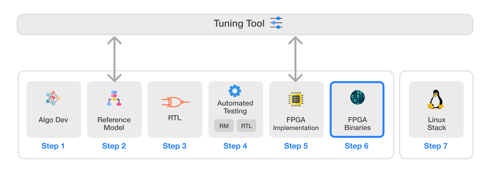

# Infinite-ISP
Infinite-ISP는 하드웨어 ISP의 모든 측면을 고려하여 설계된 풀스택 ISP 개발 플랫폼입니다. 이 플랫폼은 Python으로 작성된 카메라 파이프라인 모듈 컬렉션, 고정 소수점(fixed-point) 참조 모델, 최적화된 RTL 설계, FPGA 통합 프레임워크, 그리고 Xilinx® Kria KV260 개발 보드 및 Efinix® Titanium Ti180 J484 개발 키트에서 즉시 사용 가능한 관련 펌웨어를 포함하고 있습니다. 또한, 다양한 센서 및 애플리케이션에 맞춰 ISP 파이프라인의 매개변수를 조정할 수 있는 독립형 Python 기반 튜닝 도구(Tuning Tool)를 제공합니다. 마지막으로, 필요한 드라이버와 커스텀 애플리케이션 개발 스택을 제공하여 Infinite-ISP를 Linux 플랫폼으로 이식할 수 있는 소프트웨어 솔루션도 포함하고 있습니다.



| 번호 | 저장소 이름 | 설명 |
|---------| -------------  | ------------- |
| 1 | **[Infinite-ISP_AlgorithmDesign](https://github.com/10x-Engineers/Infinite-ISP)** | 알고리즘 개발을 위한 Infinite-ISP 파이프라인의 Python 기반 모델 |
| 2 | **[Infinite-ISP_ReferenceModel](https://github.com/10x-Engineers/Infinite-ISP_ReferenceModel)** | 하드웨어 구현을 위한 Infinite-ISP 파이프라인의 Python 기반 고정 소수점 모델 |
| 3 | **[Infinite-ISP_RTL](https://github.com/10x-Engineers/Infinite-ISP_RTL)** | 참조 모델을 기반으로 한 이미지 신호 처리기(ISP)의 RTL Verilog 설계 |
| 4 | **[Infinite-ISP_AutomatedTesting](https://github.com/10x-Engineers/Infinite-ISP_AutomatedTesting)** | 비트 단위까지 정확한 설계를 보장하기 위한 이미지 신호 처리기의 블록 및 멀티 블록 레벨 자동화 테스트 프레임워크 |
| 5 | **FPGA 구현** | 다음 보드에서의 Infinite-ISP FPGA 구현: <br> <ul><li>Xilinx® Kria KV260의 XCK26 Zynq UltraScale + MPSoC **[Infinite-ISP_FPGA_XCK26](https://github.com/10x-Engineers/Infinite-ISP_FPGA_XCK26)** </li></ul> |
| 6 | **[Infinite-ISP_FPGABinaries](https://github.com/10x-Engineers/Infinite-ISP_FPGABinaries)** :anchor: | Xilinx® Kria KV260의 XCK26 Zynq UltraScale + MPSoC 및 Efinix® Titanium Ti180 J484 개발 키트를 위한 FPGA 바이너리(비트스트림 + 펌웨어 실행 파일) |
| 7 | **[Infinite-ISP_TuningTool](https://github.com/10x-Engineers/Infinite-ISP_TuningTool)** | Infinite-ISP를 위한 캘리브레이션 및 분석 도구 모음 |
| 8 | **[Infinite-ISP_LinuxCameraStack](https://github.com/10x-Engineers/Infinite-ISP_LinuxCameraStack.git)** | Infinite-ISP의 Linux 지원 확장 및 Linux 기반 카메라 애플리케이션 스택 개발 |

**Infinite-ISP_RTL, Infinite-ISP_AutomatedTesting** 및 **Infinite-ISP_FPGA_XCK26** 저장소에 대한 **[액세스 요청](https://docs.google.com/forms/d/e/1FAIpQLSfOIldU_Gx5h1yQEHjGbazcUu0tUbZBe0h9IrGcGljC5b4I-g/viewform?usp=sharing)**


# Infinite-ISP FPGA Binaries
[Xilinx® Kria™ KV260 비전 AI 스타터 키트](./binaries/xilinx_xck26) 및 [Efinix® Titanium Ti180 J484 개발 키트](./binaries/efinix_ti180)를 위한 Infinite-ISP 이미지 신호 처리(ISP) 파이프라인 FPGA 바이너리입니다. 각 바이너리 파일은 FPGA 비트스트림과 그에 대응하는 펌웨어 실행 파일로 구성되어 있습니다.

## 디렉토리 구조

- 이 저장소의 디렉토리 구조는 다음과 같습니다:
```plaintext
메인 디렉토리(Infinite-ISP_FPGABinaries)
│
├── binaries
│   ├── xilinx_xck26
│   └── efinix_ti180
│         
│
├── doc
│   ├── xilinx_xck26
│   ├── efinix_ti180
│   ├── assets
│   └── user_guide
│  
│   
├── scripts
    ├── xilinx_xck26
    └── efinix_ti180
```
* **binaries**: Xilinx® Kria™ KV260 비전 AI 스타터 키트 및 Efinix® Titanium Ti180 J484 개발 키트를 위한 바이너리 파일을 포함합니다.
* **doc**: 사용자 가이드 및 구성 메뉴를 포함합니다.
* **scripts**: 파일 변환을 위한 Python 스크립트를 포함합니다.

## 라이선스
이 프로젝트는 Apache 2.0 라이선스 하에 배포됩니다 ([LICENSE](LICENSE) 파일 참조).

## 연락처
문의 사항이나 피드백이 있으시면 언제든지 연락해 주시기 바랍니다.

이메일: isp@10xengineers.ai

웹사이트: http://www.10xengineers.ai

링크드인: https://www.linkedin.com/company/10x-engineers/