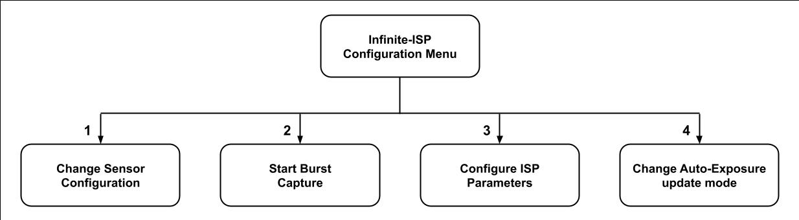
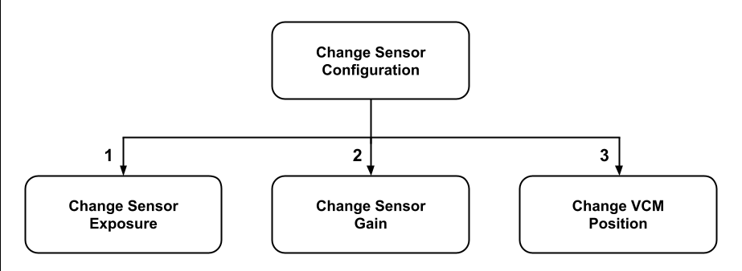
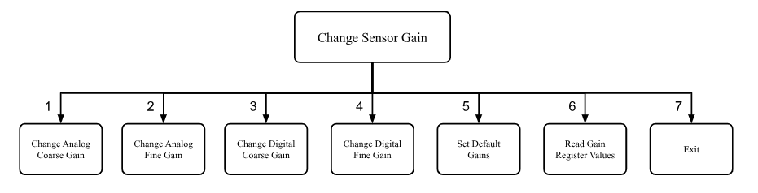

# 사용자 가이드 (USER GUIDE)

Infinite-ISP 설정 메뉴(Configuration Menu)에는 세 가지 옵션이 있습니다. 노출 시간이나 아날로그/디지털 게인 설정과 같은 센서 설정을 변경하거나, 최대 193장의 연속 프레임을 캡처하는 버스트 캡처(Burst Capture)를 시작할 수 있으며, ISP 파라미터를 변경하거나 센서 모듈의 초점을 조절할 수도 있습니다. Infinite-ISP 설정 메뉴의 계층 구조는 다음과 같습니다:

<kbd></kbd> 

## 센서 설정 변경 (Change Sensor Configuration):

"Infinite-ISP Configuration Menu"의 옵션 1을 선택하면, 센서의 노출 시간이나 아날로그/디지털 게인 중 하나를 변경할지 묻는 메시지가 나타납니다. "Change Sensor Configuration" 메뉴의 계층 구조는 아래와 같습니다.

<kbd></kbd> 

"Change Sensor Configuration" 메뉴에서 옵션 1 (Change Sensor Exposure)을 선택하면 현재의 "coarse_integration_time" 레지스터 값이 표시되며, lines_of_frame(센서 클럭이 프레임의 한 줄을 처리하는 데 걸리는 시간) 단위로 노출 시간을 입력하라는 프롬프트가 나타납니다. 값을 입력하면 센서의 노출 시간이 즉시 변경됩니다. 이 변화는 보드에 연결된 HDMI 디스플레이를 통해 실시간으로 확인할 수 있습니다.

"Change Sensor Configuration" 메뉴에서 옵션 2 (Change Sensor Gain)를 선택하면 현재의 게인 값들이 표시되고 어떤 게인 레지스터의 값을 수정할지 묻는 프롬프트가 나타납니다. 옵션 1 ~ 4에서는 해당 옵션의 현재 게인 레지스터 값이 표시되며 새 값을 입력하도록 요청받습니다. 옵션 5를 선택하면 센서의 기본(Default) 게인 값이 적용됩니다. 옵션 6은 게인 레지스터의 현재 값들을 화면에 출력합니다. 옵션 7은 이전 "Change Sensor Configuration" 메뉴로 돌아갑니다. "Change Sensor Gain" 메뉴의 계층 구조는 아래와 같습니다.

<kbd></kbd>

"Change Sensor Configuration" 메뉴에서 옵션 3 (Exit)을 선택하면, 현재의 노출 및 게인 레지스터 값들이 SD 카드의 "ExpAndGain_AR1335.txt" 또는 "ExpAndGain_OV5647.txt" 파일에 저장된 후 "Infinite-ISP Configuration Menu"로 돌아갑니다. 만약 보드에 SD 카드가 삽입되어 있지 않다면, 몇 초간 대기한 후 오류 메시지가 나타납니다.

## 버스트 캡처 시작 (Start Burst Capture):

 
"Infinite-ISP Configuration Menu"의 옵션 2 (Start Burst Capture)를 선택하면 캡처(Dump)할 프레임 수를 입력하라는 메시지가 나타납니다. 그다음, 버스트 캡처를 시작하기 전에 건너뛸(Skip) 프레임 수를 묻습니다. 값을 입력하는 즉시 기능이 시작되며, 설정한 프레임만큼 건너뛸 때까지 대기합니다. 이 대기 시간 동안 화면에는 캡처될 시점과 입력 후 경과된 시간이 표시됩니다. 예를 들어 AR1335 센서의 초당 프레임 수(FPS)가 30일 때 건너뛸 프레임으로 100을 입력했다면, floor(100 / FPS) 즉 floor(100 / 30) = 3초 동안 대기한 후 장면을 캡처하게 됩니다.

대기 시간이 끝나면 버스트 캡처 기능의 상태가 표시됩니다. 장면 캡처가 완료되면 'In memory(메모리 저장됨)' 플래그가 켜지고, 캡처된 프레임이 SD 카드에 성공적으로 기록되면 'In SD card(SD 카드 저장됨)' 플래그가 켜집니다. 시스템은 RAW 프레임을 먼저 기록한 후 ISPout(ISP 처리된) 프레임을 기록합니다. 프레임이 SD 카드에 모두 저장되면 다시 "Infinite-ISP Configuration Menu"로 돌아옵니다.

## ISP 파라미터 구성 (Configure ISP Parameters):

"Configure ISP Parameters" 메뉴 옵션을 통해 설정할 수 있는 여러 ISP 모듈이 있습니다. 이 메뉴들을 살펴보고 다양한 모듈의 파라미터를 변경해 보며 Infinite-ISP를 테스트해 보십시오. 각 하위 모듈은 현재 설정된 파라미터 값을 보여주고 새로운 값을 입력하도록 요청합니다.

## 자동 노출 업데이트 모드 변경 (Change Auto-Exposure update mode)

"Infinite-ISP Configuration Menu"의 옵션 4를 선택하면 자동 노출(AE) 제어 루프를 변경할 수 있습니다. 옵션 1은 AE 펌웨어 루프(소프트웨어 방식)를 선택하고, 옵션 2는 하드웨어 AE 루프를 선택합니다.