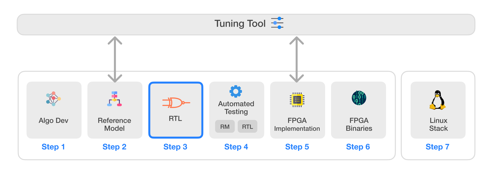
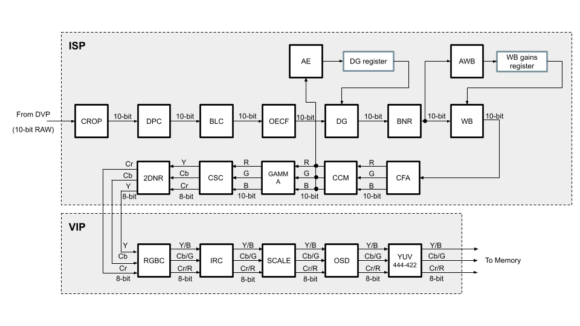

# Infinite-ISP
Infinite-ISP는 하드웨어 ISP의 모든 측면을 고려하여 설계된 풀스택 ISP 개발 플랫폼입니다. 이 플랫폼은 Python으로 작성된 카메라 파이프라인 모듈 컬렉션, 고정 소수점(fixed-point) 참조 모델, 최적화된 RTL 설계, FPGA 통합 프레임워크, 그리고 Xilinx® Kria KV260 개발 보드에서 즉시 사용 가능한 관련 펌웨어를 포함하고 있습니다. 또한, 다양한 센서 및 애플리케이션에 맞춰 ISP 파이프라인의 매개변수를 조정할 수 있는 독립형 Python 기반 튜닝 도구(Tuning Tool)를 제공합니다. 마지막으로, 필요한 드라이버와 커스텀 애플리케이션 개발 스택을 제공하여 Infinite-ISP를 Linux 플랫폼으로 이식할 수 있는 소프트웨어 솔루션도 포함하고 있습니다.

| 번호 | 저장소 이름 | 설명 |
|---------| -------------  | ------------- |
| 1 | **[Infinite-ISP_AlgorithmDesign](https://github.com/10x-Engineers/Infinite-ISP)** | 알고리즘 개발을 위한 Infinite-ISP 파이프라인의 Python 기반 모델 |
| 2 | **[Infinite-ISP_ReferenceModel](https://github.com/10x-Engineers/Infinite-ISP_ReferenceModel)** | 하드웨어 구현을 위한 Infinite-ISP 파이프라인의 Python 기반 고정 소수점 모델 |
| 3 | **[Infinite-ISP_RTL](https://github.com/10x-Engineers/Infinite-ISP_RTL)** :anchor: | 참조 모델을 기반으로 한 이미지 신호 처리기(ISP)의 RTL Verilog 설계 |
| 4 | **[Infinite-ISP_AutomatedTesting](https://github.com/10x-Engineers/Infinite-ISP_AutomatedTesting)** :anchor: | 비트 단위까지 정확한 설계를 보장하기 위한 이미지 신호 처리기의 블록 및 멀티 블록 레벨 자동화 테스트 프레임워크 |
| 5 | **FPGA 구현** :anchor: | 다음 보드에서의 Infinite-ISP FPGA 구현:   <ul><li>Xilinx® Kria KV260의 XCK26 Zynq UltraScale + MPSoC **[Infinite-ISP_FPGA_XCK26](https://github.com/10x-Engineers/Infinite-ISP_FPGA_XCK26)** </li></ul> |
| 6 | **[Infinite-ISP_FPGABinaries](https://github.com/10x-Engineers/Infinite-ISP_FPGABinaries)** | Xilinx® Kria KV260의 XCK26 Zynq UltraScale + MPSoC용 FPGA 바이너리(비트스트림 + 펌웨어 실행 파일) |
| 7 | **[Infinite-ISP_TuningTool](https://github.com/10x-Engineers/Infinite-ISP_TuningTool)** | Infinite-ISP를 위한 캘리브레이션 및 분석 도구 모음 |
| 8 | **[Infinite-ISP_LinuxCameraStack](https://github.com/10x-Engineers/Infinite-ISP_LinuxCameraStack.git)** | Infinite-ISP의 Linux 지원 확장 및 Linux 기반 카메라 애플리케이션 스택 개발 |

**Infinite-ISP_RTL, Infinite-ISP_AutomatedTesting** 및 **Infinite-ISP_FPGA_XCK26** 저장소에 대한 **[액세스 요청](https://docs.google.com/forms/d/e/1FAIpQLSfOIldU_Gx5h1yQEHjGbazcUu0tUbZBe0h9IrGcGljC5b4I-g/viewform?usp=sharing)**

# Infinite-ISP RTL

Infinite-ISP_RTL은 Infinite-ISP(이미지 신호 처리기)를 위한 RTL 개발을 포함하는 프로젝트입니다. 이 저장소는 [Infinite-ISP_ReferenceModel](https://github.com/10x-Engineers/Infinite-ISP_ReferenceModel) (RM)을 참조로 사용하며, 참조 모델의 비트 단위까지 정확한(bit-accurate) 변환을 보장합니다. 이러한 워크플로우는 하드웨어 설계와 알고리즘 개발 분야 모두의 전문 지식 통합을 용이하게 합니다. 참조 모델(RM)의 각 블록은 RTL 저장소 내의 해당 Verilog 모듈에 매핑됩니다. FPGA 통합 및 재사용성 향상을 위해 이러한 모듈은 ISP와 VIP의 두 그룹으로 분류됩니다.

`Infinite-ISP_RTL v1.0`의 ISP RTL 파이프라인

## 목표
인터넷에는 많은 오픈 소스 ISP들이 존재합니다. 대부분은 개별 기여자들에 의해 개발되었으며 각기 장단점이 있습니다. 또한, 일반적으로 소프트웨어 기반이며 RTL 지원이 부족한 경우가 많습니다. 이 프로젝트는 모든 오픈 소스 ISP 개발을 한곳으로 집중시켜, ISP 개발자들이 알고리즘 개발부터 FPGA 및 ASIC 준비를 위한 후속 단계까지 기여할 수 있는 단일 플랫폼을 제공하는 것을 목표로 합니다.

## 액세스 권한을 얻는 방법
액세스하려면 **링크**의 요청 양식을 작성해 주세요. 10xEngineers에서 영업일 기준 1일 이내에 저장소 액세스 권한을 승인해 드립니다. 액세스 상태를 확인하는 이메일 알림을 받게 됩니다.

## 리소스 사용률

아래는 Xilinx® Vivado IDE v2022.1을 사용하여 Xilinx® Kria KV260 개발 보드용으로 컴파일된 리소스 사용률 표입니다.

**ISP 리소스 사용률 (2048x1536 해상도):**

| 블록 이름 &nbsp;&nbsp;&nbsp;&nbsp;&nbsp;&nbsp;&nbsp;&nbsp;&nbsp;&nbsp;&nbsp;&nbsp;&nbsp;&nbsp;&nbsp;&nbsp;&nbsp;&nbsp;&nbsp;&nbsp;&nbsp;&nbsp;&nbsp;&nbsp;&nbsp;&nbsp;&nbsp;&nbsp;&nbsp; | LUT | FF | BRAM | DSP |
| ------------------- | :---------: | :---------: | :---------: | :---------: |
| Crop | 159 | 144 | 0 | 0 |
| DPC | 652 | 642 | 4 | 0 |
| BLC | 117 | 120 | 0 | 4 |
| OECF | 37 | 62 | 2 | 0 |
| DG | 250 | 17 | 0 | 1 |
| BNR | 10087 | 6567 | 20 | 25 |
| WB | 33 | 44 | 0 | 1 |
| Demosaic | 739 | 628 | 4 | 0 |
| AE | 2308 | 2242 | 0 | 5 |
| AWB | 803 | 922 | 1 | 0 |
| CCM | 136 | 263 | 0 | 9 |
| GC | 31 | 67 | 1.5 | 0 |
| CSC | 281 | 387 | 0 | 13 |
| 2DNR | 23210 | 4403 | 8 | 0 |
| isp_top | 38771 | 16694 | 40.5 | 58 |

**VIP 리소스 사용률 (2048x1536 해상도):**

| 블록 이름 &nbsp;&nbsp;&nbsp;&nbsp;&nbsp;&nbsp;&nbsp;&nbsp;&nbsp;&nbsp;&nbsp;&nbsp;&nbsp;&nbsp;&nbsp;&nbsp;&nbsp;&nbsp;&nbsp;&nbsp;&nbsp;&nbsp;&nbsp;&nbsp;&nbsp;&nbsp;&nbsp;&nbsp;&nbsp; | LUT | FF | BRAM | DSP |
| ------------------- | :---------: | :---------: | :---------: | :---------: |
| RGBC | 388 | 231 | 0 | 0 |
| IRC | 124 | 42 | 0 | 0 |
| Scale | 381 | 184 | 0 | 0 |
| OSD | 1021 | 532 | 1 | 0 |
| YUV Conv | 31 | 54 | 0 | 0 |
| vip_top | 1983 | 1251 | 1 | 0 |

**ISP 파이프라인 리소스 사용률 (2048x1536 해상도):**

| 블록 이름 &nbsp;&nbsp;&nbsp;&nbsp;&nbsp;&nbsp;&nbsp;&nbsp;&nbsp;&nbsp;&nbsp;&nbsp;&nbsp;&nbsp;&nbsp;&nbsp;&nbsp;&nbsp;&nbsp;&nbsp;&nbsp;&nbsp;&nbsp;&nbsp;&nbsp;&nbsp;&nbsp;&nbsp;&nbsp; | LUT | FF | BRAM | DSP |
| ------------------- | :---------: | :---------: | :---------: | :---------: |
| isp_top + vip_top | 40754 | 17945 | 41.5 | 58 |

## 라이선스
이 프로젝트는 Apache 2.0 라이선스 하에 배포됩니다 (LICENSE 파일 참조).

## 감사의 글
- Infinite-ISP_RTL 프로젝트는 bxinquan/zynqmp_cam_isp_demo로부터 영감을 받아 시작되었습니다.

## 연락처
문의 사항이나 피드백이 있으시면 언제든지 연락해 주시기 바랍니다.

이메일: isp@10xengineers.ai
웹사이트: http://www.10xengineers.ai
링크드인: https://www.linkedin.com/company/10x-engineers/