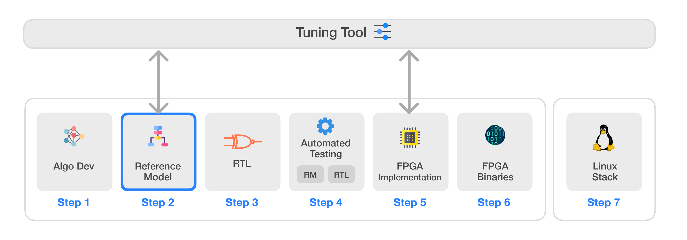
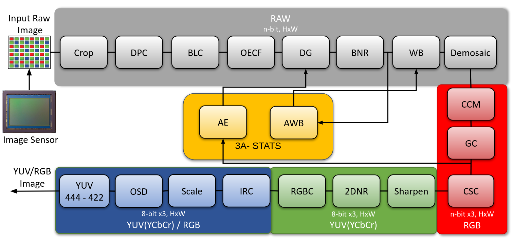

# Infinite-ISP
Infinite-ISP는 하드웨어 ISP의 모든 측면을 고려하여 설계된 풀스택 ISP 개발 플랫폼입니다. 이 플랫폼은 Python으로 작성된 카메라 파이프라인 모듈 컬렉션, 고정 소수점(fixed-point) 참조 모델, 최적화된 RTL 설계, FPGA 통합 프레임워크, 그리고 Xilinx® Kria KV260 개발 보드에서 즉시 사용 가능한 관련 펌웨어를 포함하고 있습니다. 또한, 다양한 센서 및 애플리케이션에 맞춰 ISP 파이프라인의 매개변수를 조정할 수 있는 독립형 Python 기반 튜닝 도구(Tuning Tool)를 제공합니다. 마지막으로, 필요한 드라이버와 커스텀 애플리케이션 개발 스택을 제공하여 Infinite-ISP를 Linux 플랫폼으로 이식할 수 있는 소프트웨어 솔루션도 포함하고 있습니다.



| 번호 | 저장소 이름 | 설명 |
|---------| -------------  | ------------- |
| 1 | **[Infinite-ISP_AlgorithmDesign](https://github.com/10x-Engineers/Infinite-ISP)** | 알고리즘 개발을 위한 Infinite-ISP 파이프라인의 Python 기반 모델 |
| 2 | **[Infinite-ISP_ReferenceModel](https://github.com/10x-Engineers/Infinite-ISP_ReferenceModel)** :anchor: | 하드웨어 구현을 위한 Infinite-ISP 파이프라인의 Python 기반 고정 소수점 모델 |
| 3 | **[Infinite-ISP_RTL](https://github.com/10x-Engineers/Infinite-ISP_RTL)** | 참조 모델을 기반으로 한 이미지 신호 처리기(ISP)의 RTL Verilog 설계 |
| 4 | **[Infinite-ISP_AutomatedTesting](https://github.com/10x-Engineers/Infinite-ISP_AutomatedTesting)** | 비트 단위까지 정확한 설계를 보장하기 위한 이미지 신호 처리기의 블록 및 멀티 블록 레벨 자동화 테스트 프레임워크 |
| 5 | **FPGA 구현** | 다음 보드에서의 Infinite-ISP FPGA 구현: <br> <ul><li>Xilinx® Kria KV260의 XCK26 Zynq UltraScale + MPSoC **[Infinite-ISP_FPGA_XCK26](https://github.com/10x-Engineers/Infinite-ISP_FPGA_XCK26)** </li></ul> |
| 6 | **[Infinite-ISP_FPGABinaries](https://github.com/10x-Engineers/Infinite-ISP_FPGABinaries)** | Xilinx® Kria KV260의 XCK26 Zynq UltraScale + MPSoC용 FPGA 바이너리(비트스트림 + 펌웨어 실행 파일) |
| 7 | **[Infinite-ISP_TuningTool](https://github.com/10x-Engineers/Infinite-ISP_TuningTool)** | Infinite-ISP를 위한 캘리브레이션 및 분석 도구 모음 |
| 8 | **[Infinite-ISP_LinuxCameraStack](https://github.com/10x-Engineers/Infinite-ISP_LinuxCameraStack.git)** | Infinite-ISP의 Linux 지원 확장 및 Linux 기반 카메라 애플리케이션 스택 개발 |

**Infinite-ISP_RTL, Infinite-ISP_AutomatedTesting** 및 **Infinite-ISP_FPGA_XCK26** 저장소에 대한 **[액세스 요청](https://docs.google.com/forms/d/e/1FAIpQLSfOIldU_Gx5h1yQEHjGbazcUu0tUbZBe0h9IrGcGljC5b4I-g/viewform?usp=sharing)**


# Infinite-ISP 참조 모델(Reference Model): 카메라 파이프라인 모듈의 RTL 구현을 위한 Python 기반 모델

## 개요
Infinite-ISP 참조 모델은 Infinite-ISP 파이프라인의 Python 기반 고정 소수점(fixed-point) 구현체입니다. 센서의 입력 RAW 이미지를 출력 RGB 이미지로 변환하도록 설계된 포괄적인 카메라 파이프라인 모듈 모음입니다. 이 모델은 파이프라인의 기능과 동작에 대한 엄격한 테스트, 검증 및 확인을 가능하게 하는 RTL 코드 생성을 돕는 참조 구현을 제공합니다.

이 모델은 Gaussian 및 Sigmoid와 같은 복잡한 함수에 룩업 테이블(LUT)을 사용하며, 나눗셈 및 제곱근에 대해 고정 소수점 숫자 또는 커스텀 근사치를 적용하여 이미지 품질 손실을 최소화하면서 최적화합니다.

현재 상태에서 이 모델은 모듈별로 단순한 알고리즘을 구현하고 있으며, 향후 버전에서는 RTL 친화적인 복잡한 알고리즘을 통합할 계획입니다.



`InfiniteISP_ReferenceModel v1.0`의 ISP 파이프라인

## 주요 내용

1. **RTL 친화적 코드**: 룩업 테이블, 커스텀 근사치 및 정수 연산과 같은 최적화를 통해 RTL로 직접 변환할 수 있는 카메라 파이프라인 모듈의 Python 구현을 제공합니다.

2. **데이터셋 처리**: 서로 다르거나 동일한 설정 파일을 사용하여 여러 이미지에 대해 실행할 수 있도록 지원합니다.

3. **비디오 처리**: 프레임 간에 작동하는 3A 통계(3A Statistics) 데이터가 흐르는 순차 프레임 처리가 가능한 비디오 처리 스크립트도 포함하고 있습니다.

## 목표
Infinite-ISP_ReferenceModel의 주요 목표는 카메라 파이프라인 모듈을 RTL 친화적인 구현으로 변환하는 과정을 간소화하는 오픈 소스 Python 기반 모델을 만드는 것입니다. 이를 통해 하드웨어 설계와의 원활한 통합을 가능하게 하고 효율적인 이미지 처리 시스템 개발을 단순화합니다. 최적화된 알고리즘과 비디오 처리 기능을 제공함으로써, 이 모델은 이미지 처리 프로젝트 및 RTL 구현을 담당하는 개발자들에게 귀중한 도구가 되는 것을 목표로 합니다.

# 기능 목록
아래 표는 모델의 기능 목록을 제공합니다. 모델 버전 `1.0`은 각 모듈에 대해 하드웨어 친화적이고 단순한 알고리즘을 구현합니다.

| 모듈 | Infinite-ISP_ReferenceModel 설명 | 
| -------------  | ------------- |         
| Crop | 베이어 패턴(Bayer pattern)을 고려하여 이미지를 자름 | 
| Dead Pixel Correction | 수정된 Yongji et al, Dynamic Defective Pixel Correction for Image Sensor 알고리즘 적용 |
| Black Level Correction | 캘리브레이션/센서 의존적 <br> - 튜닝 도구를 사용하여 조정 가능한 설정 파일의 매개변수 적용 |
| Optical Electronic Transfer Function (OECF) | 캘리브레이션/센서 의존적 <br> - 설정 파일의 LUT 구현 |
| Digital Gain | 설정 파일의 게인 값 적용 <br> - 자동 모드에서는 디지털 게인 선택을 위해 AE 피드백 통합 |
| Bayer Noise Reduction | Green Channel Guiding Denoising by Tan et al <br> - LUT를 통한 Chroma 및 Spatial 필터 구현 |
| Auto White Balance | 향상된 Gray World 알고리즘 <br> - 최적 임계값 내에서 AWB 통계 계산 |
| White Balance | WB 게인 곱셈 <br> - 튜닝 도구를 사용하여 조정 가능한 설정 파일의 매개변수 적용 |
| Demosaic | Malwar He Cutler’s 데모자이킹 알고리즘 |
| Color Correction Matrix | 캘리브레이션/센서 의존적 <br> - 튜닝 도구를 사용하여 조정 가능한 설정 파일의 3x3 CCM 적용 |
| Gamma Correction | 설정 파일의 LUT 구현 |
| Auto Exposure | Auto Exposure <br> - 왜도(skewness) 기반의 AE 통계 계산 |
| Color Space Conversion | YCbCr 디지털 <br> - BT 601 <br> - Bt 709 |
| Sharpening | 강도 조절이 가능한 단순한 언샤프 마스킹(unsharp masking) |
| Noise Reduction | Non-local means filter <br> - LUT를 통한 명암 레벨 차이 구현 |
| RGB Conversion | YCbCr 디지털 이미지를 RGB로 변환 |
| Invalid Region Crop | 이미지를 고정된 크기로 자름 |
| On Screen Display | 왼쪽 상단에 10x 로고 추가 | 
| Scale | Nearest Neighbor <br> - 정수 스케일링 |
| YUV Format | YUV <br> - 444 <br> - 422 |

## 의존성
이 프로젝트는 `Python_3.9.12`와 호환됩니다.

의존성 목록은 requirements.txt 파일에 나열되어 있습니다.

이 프로젝트는 pip 패키지 관리자가 설치되어 있다고 가정합니다.

## 실행 방법
파이프라인을 실행하려면 다음 단계를 따르세요.
1. 다음 명령어를 사용하여 저장소를 클론합니다.
```shell
git clone https://github.com/10xEngineersTech/Infinite-ISP_ReferenceModel
```

2. 다음 명령어를 실행하여 requirements 파일의 모든 요구 사항을 설치합니다.
```shell
pip install -r requirements.txt
```
3. isp_pipeline.py를 실행합니다.
```shell
python isp_pipeline.py
```

### 예시
프로젝트의 in_frames/normal 폴더에 이미 튜닝된 설정이 포함된 몇 가지 샘플 이미지가 추가되어 있습니다. 이 중 하나를 실행하려면 설정 파일 이름을 제공된 샘플 설정 중 하나로 바꾸기만 하면 됩니다. 예를 들어 `Indoor1_2592x1536_12bit_RGGB.raw`에서 파이프라인을 실행하려면 isp_pipeline.py에서 설정 파일 이름과 데이터 경로를 다음과 같이 변경합니다.

```python
CONFIG_PATH = './config/Indoor1_2592x1536_12bit_RGGB-configs.yml'
RAW_DATA = './in_frames/normal/data'
```

## 다중 이미지/데이터셋에서 파이프라인 실행 방법
다중 이미지에서 Infinite-ISP를 실행하는 두 가지 스크립트가 있습니다.

1. isp_pipeline_dataset.py 
    <br >여러 이미지를 실행합니다. 각 RAW 이미지는 파일명이 `<filename>.raw`일 때 `<filename>-configs.yml`이라는 이름의 자체 설정 파일을 가져야 하며, 그렇지 않으면 기본 설정 파일인 configs.yml이 사용됩니다.

2. video_processing.py 
   <br> 데이터셋의 각 이미지를 순차적인 비디오 프레임으로 간주합니다. 모든 이미지는 configs.yml의 동일한 설정 매개변수를 사용하며, 한 프레임에서 계산된 3A 통계가 다음 프레임에 적용됩니다.

저장소를 클론하고 모든 의존성을 설치한 후 다음 단계를 따르세요.

1. `DATASET_PATH`를 데이터셋 폴더로 설정합니다. 예를 들어 이미지가 in_frames/normal/data 폴더에 있는 경우:
```python
DATASET_PATH = './in_frames/normal/data'
```

2. 데이터셋이 다른 git 저장소에 있는 경우, 루트 디렉토리에서 다음 명령어를 사용하여 서브모듈로 사용할 수 있습니다. 여기서 `<url>`은 git 저장소 주소이고, `<path>`는 서브모듈을 추가할 위치입니다. Infinite-ISP의 경우 `<path>`는 `./in_frames/normal/<dataset_name>`이어야 합니다. in_frames/normal/data 디렉토리가 이미 존재하므로 `<dataset_name>`은 `data`가 아니어야 함을 유의하세요.

```shell
git submodule add <url> <path>
git submodule update --init --recursive
``` 

4. git 저장소를 서브모듈로 추가한 후 isp_pipeline_dataset.py의 `DATASET_PATH` 변수를 `./in_frames/normal/<dataset_name>`으로 업데이트합니다. Git은 서브모듈을 사용하여 저장소의 하위 폴더만 가져오는 것을 허용하지 않습니다. 전체 저장소를 추가한 후 해당 폴더에 접근해야 합니다. 서브모듈의 하위 폴더에 있는 이미지를 사용하려면 isp_pipeline_dataset.py 또는 video_processing.py의 `DATASET_PATH` 변수를 그에 맞게 수정하세요.

```python
DATASET_PATH = './in_frames/normal/<dataset_name>'
```

5. `isp_pipeline_dataset.py` 또는 `video_processing.py`를 실행합니다.
6. 처리된 이미지는 out_frames 폴더에 저장됩니다.

## 기여하기
풀 리퀘스트(Pull Request)를 보내기 전에 기여 가이드라인을 읽어주시기 바랍니다.

## 결과
다음은 시장 경쟁력이 있는 ISP와 이 파이프라인의 결과를 비교한 것입니다.
우리 ISP의 출력은 오른쪽에 표시되어 있으며, 기준이 되는 그라운드 트루스(ground truths)는 왼쪽에 표시되어 있습니다.

&emsp;&emsp;&emsp;&emsp;&emsp;&emsp;&emsp;&emsp;&emsp;&emsp; **그라운드 트루스** &emsp;&emsp;&emsp;&emsp;&emsp;&emsp;&emsp;&emsp;&emsp;&emsp;&emsp;&emsp;&emsp;&emsp;&emsp;&emsp;&emsp;&emsp;&emsp;&emsp;&emsp;&emsp;&emsp;&emsp;&emsp;&emsp; **infiniteISP_RM** 
!
!
!
!
!

PSNR 및 SSIM 이미지 품질 메트릭을 기반으로 한 위 결과의 비교표입니다.

| 이미지 | PSNR | SSIM |
|-----------|-------|-------|
| Indoor1 | 22.5788 | 0.8923 |
| Outdoor1 | 19.1544 | 0.9048 |
| Outdoor2 | 18.8681 | 0.8071 |
| Outdoor3 | 17.2825 | 0.7304 |
| Outdoor4 | 19.9814 | 0.8198 |

## 사용자 가이드
더 포괄적인 알고리즘 문서와 Python 모델 사용 방법을 이해하려면 사용자 가이드를 방문하세요.

## 라이선스
이 프로젝트는 Apache 2.0 라이선스 하에 배포됩니다 (LICENSE 파일 참조).

## 연락처
문의 사항이나 피드백이 있으시면 언제든지 연락해 주시기 바랍니다.

이메일: isp@10xengineers.ai
웹사이트: http://www.10xengineers.ai
링크드인: https://www.linkedin.com/company/10x-engineers/