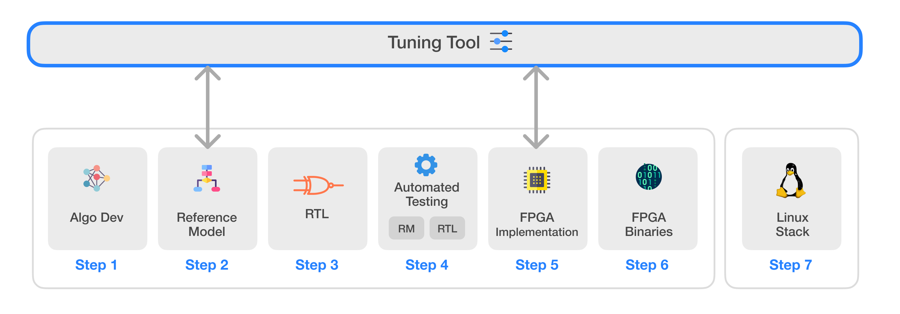
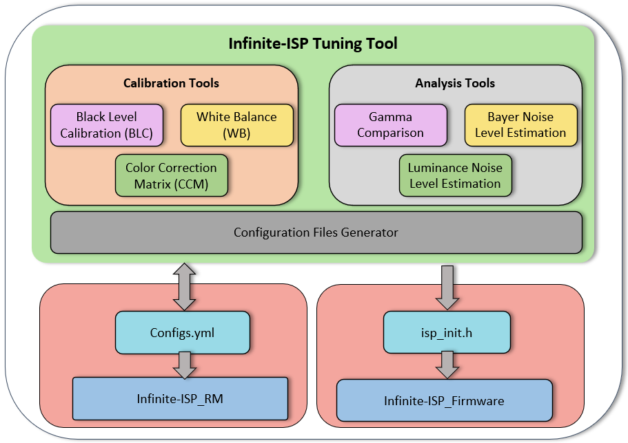

# Infinite-ISP
Infinite-ISP는 하드웨어 ISP의 모든 측면을 고려하여 설계된 풀스택 ISP 개발 플랫폼입니다. 이 플랫폼은 Python으로 작성된 카메라 파이프라인 모듈 컬렉션, 고정 소수점(fixed-point) 참조 모델, 최적화된 RTL 설계, FPGA 통합 프레임워크, 그리고 Xilinx® Kria KV260 개발 보드에서 즉시 사용 가능한 관련 펌웨어를 포함하고 있습니다. 또한, 다양한 센서 및 애플리케이션에 맞춰 ISP 파이프라인의 매개변수를 조정할 수 있는 독립형 Python 기반 튜닝 도구(Tuning Tool)를 제공합니다. 마지막으로, 필요한 드라이버와 커스텀 애플리케이션 개발 스택을 제공하여 Infinite-ISP를 Linux 플랫폼으로 이식할 수 있는 소프트웨어 솔루션도 포함하고 있습니다.




| 번호 | 저장소 이름 | 설명 |
|---------| -------------  | ------------- |
| 1 | **[Infinite-ISP_AlgorithmDesign](https://github.com/10x-Engineers/Infinite-ISP)** | 알고리즘 개발을 위한 Infinite-ISP 파이프라인의 Python 기반 모델 |
| 2 | **[Infinite-ISP_ReferenceModel](https://github.com/10x-Engineers/Infinite-ISP_ReferenceModel)** | 하드웨어 구현을 위한 Infinite-ISP 파이프라인의 Python 기반 고정 소수점 모델 |
| 3 | **[Infinite-ISP_RTL](https://github.com/10x-Engineers/Infinite-ISP_RTL)** | 참조 모델을 기반으로 한 이미지 신호 처리기(ISP)의 RTL Verilog 설계 |
| 4 | **[Infinite-ISP_AutomatedTesting](https://github.com/10x-Engineers/Infinite-ISP_AutomatedTesting)** | 비트 단위까지 정확한 설계를 보장하기 위한 이미지 신호 처리기의 블록 및 멀티 블록 레벨 자동화 테스트 프레임워크 |
| 5 | **FPGA 구현** | 다음 보드에서의 Infinite-ISP FPGA 구현: <br> <ul><li>Xilinx® Kria KV260의 XCK26 Zynq UltraScale + MPSoC **[Infinite-ISP_FPGA_XCK26](https://github.com/10x-Engineers/Infinite-ISP_FPGA_XCK26)** </li></ul> |
| 6 | **[Infinite-ISP_FPGABinaries](https://github.com/10x-Engineers/Infinite-ISP_FPGABinaries)** | Xilinx® Kria KV260의 XCK26 Zynq UltraScale + MPSoC용 FPGA 바이너리(비트스트림 + 펌웨어 실행 파일) |
| 7 | **[Infinite-ISP_TuningTool](https://github.com/10x-Engineers/Infinite-ISP_TuningTool)** :anchor: | Infinite-ISP를 위한 캘리브레이션 및 분석 도구 모음 |
| 8 | **[Infinite-ISP_LinuxCameraStack](https://github.com/10x-Engineers/Infinite-ISP_LinuxCameraStack.git)** | Infinite-ISP의 Linux 지원 확장 및 Linux 기반 카메라 애플리케이션 스택 개발 |

**Infinite-ISP_RTL, Infinite-ISP_AutomatedTesting** 및 **Infinite-ISP_FPGA_XCK26** 저장소에 대한 **[액세스 요청](https://docs.google.com/forms/d/e/1FAIpQLSfOIldU_Gx5h1yQEHjGbazcUu0tUbZBe0h9IrGcGljC5b4I-g/viewform?usp=sharing)**
# Infinite-ISP Tuning Tool
## 개요

Infinite-ISP Tuning Tool은 [Infinite-ISP_ReferenceModel](https://github.com/10xEngineersTech/Infinite-ISP_ReferenceModel) 및 [Infinite-ISP_Firmware](https://github.com/10xEngineersTech/Infinite-ISP_Firmware)의 다양한 모듈을 튜닝하기 위해 특별히 설계된 콘솔 기반 ISP(이미지 신호 처리기) 튜닝 애플리케이션입니다. Infinite-ISP 파이프라인과 함께 작동하는 것 외에도, 이 튜닝 도구는 이미지 품질 분석을 수행하기 위한 독립형 애플리케이션으로도 사용할 수 있습니다.

이 교차 플랫폼(cross-platform) 애플리케이션은 이미지 센서에서 직접 들어오는 Bayer RAW 이미지를 캘리브레이션하기 위한 다양한 알고리즘을 제공합니다.





## 사용법

Tuning Tool은 Infinite-ISP_ReferenceModel 및 Infinite-ISP_Firmware와 함께 작동하도록 설계되었습니다. Infinite-ISP_ReferenceModel의 설정 파일을 사용하고, 캘리브레이션을 수행하며, 파이프라인에서 사용할 수 있는 튜닝된 매개변수로 설정 파일을 업데이트합니다. 자세한 내용은 [사용자 가이드](https://github.com/10xEngineersTech/Infinite-ISP_TuningTool/blob/white_balance_update/docs/Tuning%20Tool%20User%20Guide.pdf)를 참조하세요.

Infinite-ISP Tuning Tool은 이미지 품질 분석을 위한 독립형 애플리케이션으로 별도로 사용할 수 있습니다. 이 포괄적인 도구 세트는 사용자에게 캘리브레이션 모듈에 대한 정밀한 제어를 제공할 뿐만 아니라, 분석 모듈을 사용하여 이미지의 품질을 분석할 수 있게 해줍니다. 사용 용도에 따라 다음과 같이 세 가지 범주로 나뉩니다:

- 캘리브레이션 도구 (Calibration Tools)

- 분석 도구 (Analysis Tools)

- 설정 파일 생성기 (Configuration Files Generator)

## 주요 기능
Infinite-ISP Tuning Tool은 다음과 같은 기능을 제공합니다.

| 모듈 | 설명 |
| ----------------- | ------------------------------------------------------------------ |
| Black Level Calibration (BLC) | 각 채널(R, Gr, Gb, B)에 대한 RAW 이미지의 블랙 레벨을 계산합니다. |
| White Balance (WB) | ColorChecker RAW 또는 RGB 이미지에서 화이트 밸런스 게인(R 게인 및 B 게인)을 계산합니다. |
| Color Correction Matrix (CCM) | ColorChecker RAW 또는 RGB 이미지를 사용하여 3x3 색 보정 행렬을 계산합니다. |
| Gamma | 사용자 정의 감마 곡선을 sRGB 색 공간 감마(≈ 2.2)와 비교합니다. |
| Bayer Noise Level Estimation | ColorChecker RAW 이미지에서 6개 그레이스케일 패치의 노이즈 레벨을 추정합니다. |
| Luminance Noise Level Estimation | ColorChecker RAW 또는 RGB 이미지에서 6개 그레이스케일 패치의 휘도 노이즈 레벨을 추정합니다. |
| Configuration Files | Infinite-ISP_ReferenceModel 및 FPGA 펌웨어를 위한 설정 파일을 생성합니다. |


## 시작하기

### 사전 요구 사항
이 프로젝트는 `Python_3.10.11`과 호환됩니다. <br>
<br>의존성 목록은 requirements.txt 파일에 나열되어 있습니다. <br>
<br>이 프로젝트는 pip 패키지 관리자가 설치되어 있다고 가정합니다. <br>
### 도구 설정
Tuning Tool을 사용하려면 다음 단계를 따르세요:
- 다음 명령어를 사용하여 저장소를 클론합니다:
    ```shell
    git clone https://github.com/10xEngineersTech/InfiniteISP_TuningTool.git
    ```

- 다음 명령어를 실행하여 requirements 파일의 모든 요구 사항을 설치합니다:
    ```shell
    pip install -r requirements.txt
    ```


### 실행 방법
저장소를 클론하고 모든 의존성을 설치한 후 다음 단계를 따르세요:

- 터미널을 열고 프로젝트 디렉토리로 이동합니다.

- 다음 명령어를 실행하여 Python으로 tuning_tool.py 파일을 실행합니다:
    ```shell
    python tuning_tool.py
    ```
    
위의 단계를 따르면 도구가 시작되고 콘솔이 지워지며 환영 메시지가 표시됩니다.
### 예시
Tuning Tool을 성공적으로 실행하면 사용 가능한 모든 모듈 목록이 포함된 메인 메뉴가 나타납니다.

!

- 특정 모듈을 실행하려면 위아래 화살표 버튼을 사용하여 메뉴에서 해당 옵션을 선택하기만 하면 됩니다. 예를 들어, 블랙 레벨 캘리브레이션(BLC) 모듈을 시작하려면 옵션 1을 선택합니다.

- 각 모듈의 첫 번째 단계는 해당 모듈의 특정 기능과 요구 사항을 설명하는 메인 메뉴를 표시하는 것입니다. 메뉴는 모듈과 관련된 캘리브레이션 또는 분석을 수행하기 위한 필요한 단계와 옵션을 안내합니다.

- 각 모듈은 고유한 기능에 따라 서로 다른 요구 사항과 하위 메뉴를 가집니다. 필요한 입력이 제공되면 해당 모듈 전용 알고리즘이 실행됩니다.

 - 모듈이 완료되면 해당 모듈을 다시 시작하거나, 메인 메뉴로 돌아가서 다른 모듈을 선택하거나, Tuning Tool을 종료할 수 있는 옵션이 제공됩니다. 이를 통해 여러 모듈을 편리하게 탐색하고 미세 조정할 수 있습니다.


## 기여하기

풀 리퀘스트(Pull Request)를 보내기 전에 기여 가이드라인을 읽어주시기 바랍니다.

## 사용자 가이드
더 포괄적인 문서와 Tuning Tool을 효과적으로 사용하는 방법을 이해하려면 사용자 가이드를 방문하세요. 

## 라이선스
이 프로젝트는 Apache 2.0 라이선스 하에 배포됩니다 (LICENSE 파일 참조).


## 연락처
문의 사항이나 피드백이 있으시면 언제든지 연락해 주시기 바랍니다.

이메일: isp@10xengineers.ai

웹사이트: http://www.10xengineers.ai

링크드인: https://www.linkedin.com/company/10x-engineers/